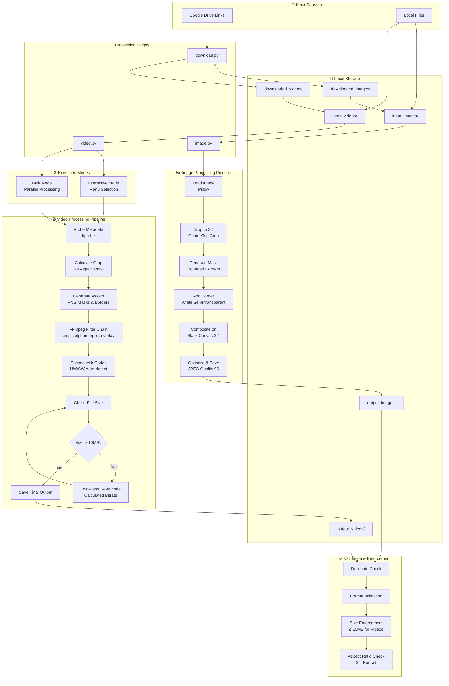
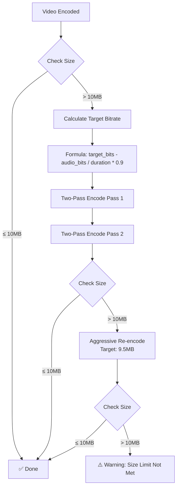

# Spotlight Media Resizer - Architecture

## System Overview



## Component Details

### 1. Download Module (`download.py`)
- **Purpose:** Fetch media from Google Drive links
- **Input:** `links_images.txt`, `links_videos.txt`
- **Output:** `downloaded_images/`, `downloaded_videos/`
- **Features:**
  - Batch download from Drive links
  - Automatic retry on failure
  - Progress tracking

### 2. Image Processing (`image.py`)
- **Purpose:** Process images to 3:4 spotlight format
- **Input:** `input_images/` (PNG, JPEG, BMP, GIF, TIFF, AVIF)
- **Output:** `output_images/` (JPEG)
- **Processing Steps:**
  1. Load image with Pillow
  2. Crop to 3:4 aspect ratio (center-crop wide, top-crop tall)
  3. Generate rounded-corner mask (radius: 16/360 of width)
  4. Apply white semi-transparent border (2px @ 15% opacity)
  5. Composite on black 3:4 canvas (1.2x height padding)
  6. Save as optimized JPEG (quality 95, no subsampling)

### 3. Video Processing (`video.py`)
- **Purpose:** Process videos to 3:4 spotlight format with size limit
- **Input:** `input_videos/` (MP4, MOV, MKV, AVI, FLV, WMV, WebM, MPG)
- **Output:** `output_videos/` (MP4, configurable)
- **Processing Steps:**
  1. Probe video metadata (width, height, duration, fps, codec)
  2. Calculate crop dimensions for 3:4 ratio
  3. Pre-generate PNG masks and borders (via Pillow)
  4. Build FFmpeg filter chain:
     - Crop input to 3:4
     - Apply rounded-corner alpha mask
     - Overlay on border image
     - Composite on black 3:4 canvas
     - Convert to yuv420p for compatibility
  5. Encode with optimal settings:
     - Hardware: VideoToolbox (h264/hevc) on Apple Silicon
     - Software: libx264/libx265 with CRF/preset
  6. Enforce 10MB limit:
     - Check output file size
     - If > 10MB: two-pass re-encode at calculated bitrate
     - Fallback: aggressive re-encode at 95% target
- **Modes:**
  - Interactive: Menu-driven selection
  - Bulk: Parallel processing with `--bulk --jobs N`

### 4. Validation Logic
- **Duplicate Detection:** Check for existing files
- **Format Conversion:**
  - Images > 1MB → JPEG (optimized)
  - Videos > 10MB → Two-pass encode
- **Quality Enforcement:**
  - Maintain aspect ratio (3:4)
  - Preserve visual quality within size constraints
  - Hardware acceleration when available

## System Requirements

### Dependencies
- Python ≥ 3.8
- Pillow (image processing)
- FFmpeg + FFprobe (video processing)

### Platform Support
- macOS: Full hardware acceleration (VideoToolbox)
- Linux/Windows: Software encoding (libx264/libx265)

### Hardware Acceleration
```
┌─────────────────────────────────────┐
│ Detect System & Capabilities       │
├─────────────────────────────────────┤
│ • Platform: Darwin/Linux/Windows    │
│ • Machine: arm64/x86_64             │
│ • Check VideoToolbox availability   │
│ • Enumerate hardware encoders       │
└─────────────────────────────────────┘
          │
          ▼
┌─────────────────────────────────────┐
│ Select Optimal Encoder              │
├─────────────────────────────────────┤
│ IF Apple Silicon + VideoToolbox     │
│   → h264_videotoolbox               │
│   → hevc_videotoolbox               │
│ ELSE                                │
│   → libx264 (preset: medium)        │
│   → libx265 (preset: medium)        │
└─────────────────────────────────────┘
```

## Data Flow

```
┌──────────────┐
│ Raw Media    │
│ (Any Ratio)  │
└──────┬───────┘
       │
       ▼
┌──────────────────────┐
│ Aspect Ratio Check   │
│ • Wide → Crop Width  │
│ • Tall → Crop Height │
│ • 3:4 → No Crop      │
└──────┬───────────────┘
       │
       ▼
┌──────────────────────┐
│ Apply Visual Effects │
│ • Rounded corners    │
│ • Border (2px white) │
│ • Black canvas       │
└──────┬───────────────┘
       │
       ▼
┌──────────────────────┐
│ Encode & Optimize    │
│ • Format: JPEG/MP4   │
│ • Quality: High      │
│ • Size: ≤ 10MB (vid) │
└──────┬───────────────┘
       │
       ▼
┌──────────────────────┐
│ Spotlight-Ready      │
│ (3:4 Portrait)       │
└──────────────────────┘
```

## File Size Enforcement Strategy



## Configuration

### Defaults (`video.py`)
```python
INPUT_FOLDER = "input_videos/"
OUTPUT_FOLDER = "output_videos/"
OUTPUT_CODEC = "h264"
OUTPUT_FORMAT = "mp4"
MAX_OUTPUT_SIZE_MB = 10
```

### CLI Arguments
```bash
# Interactive mode
python video.py

# Bulk processing
python video.py --bulk --jobs 4

# Custom folders
python video.py --input-folder /path/to/input --output-folder /path/to/output
```

## Performance Characteristics

| Mode | Processing Speed | CPU Usage | Quality |
|------|-----------------|-----------|---------|
| Interactive (HW) | 5-10x realtime | Low | High |
| Interactive (SW) | 0.5-1x realtime | Medium | High |
| Bulk (N cores) | N × single speed | High | High |
| Re-encode (2-pass) | 0.3-0.5x realtime | High | Optimal |

## Error Handling

- **Missing FFmpeg:** Exit with installation instructions
- **Invalid Input:** Skip file, log error, continue processing
- **Encode Failure:** Report error details, skip to next file
- **Size Limit Exceeded:** Automatic two-pass re-encode
- **Keyboard Interrupt:** Graceful shutdown, cleanup temp files

---

*Architecture Version 1.0 - Generated from PRD and Implementation*


